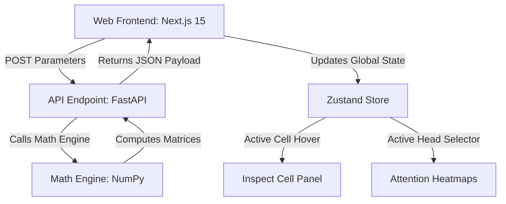

# Architectural Decision Record (ADR): Mini Attention Notebook

This document outlines the major architectural and design decisions made for the **Mini Attention Notebook**. It serves as an educational resource to explain the *why* behind our structural choices to novice engineers.

---

## ADR 1: Unified Python Math Engine & FastAPI Backend

### Context
A core goal is to visualize transformer mechanics step-by-step. Attention calculations can theoretically be run on the client (using Javascript or Tensorflow.js) or on a Python backend.

### Decision
We will execute all tensor and attention matrix operations on a **Python/FastAPI backend** using **NumPy** rather than in Javascript.

### Rationale
1. **Developer Familiarity**: Novice AI students and researchers write Python/NumPy/PyTorch. Seeing the math represented in NumPy code aligns directly with what they see in standard ML codebases.
2. **Numeric Precision & Causal Masks**: Python handles edge cases, matrix divisions, and negative infinity calculations (like `-1e9` for masking) cleanly without Javascript's quirks with floating-point math.
3. **Reusability**: The backend functions written in NumPy can be easily exported or run as standalone scripts by the student, making it a portable learning asset.

### Consequences
- Every parameter change (e.g., toggling masking, inputting text, changing dimensions) triggers an API round-trip.
- To prevent lag, we limit inputs to $N \leq 12$ tokens, ensuring API response times remain under 300ms.

---

## ADR 2: Zustand for Client-Side State Management

### Context
The user interface is highly interactive: hovering over a specific matrix cell in the center panel must instantly update the inspect panel on the right. A global state store is needed to avoid prop-drilling across deep component trees.

### Decision
We will use **Zustand** as the primary state management library on the Next.js frontend, instead of Redux or raw React Context.

### Rationale
1. **Low Boilerplate**: Zustand provides simple hooks that novice students can easily understand without writing complex actions, reducers, or wrappers.
2. **Performance (Selective Re-rendering)**: Zustand allows components to subscribe only to specific state slices (e.g., just `activeHoveredCell`), preventing complete UI re-renders on every mouse move.
3. **Coordinating Wizard Steps**: The center visualizer tracks 5 wizard steps. Zustand makes it trivial to advance/retreat steps and compute dependencies cleanly.

---

## ADR 3: Matrix Grids & Heatmap Visualization Strategy

### Context
Visualizing floating-point matrices of size up to $12 \times 12$ requires clear spatial organization. We need a way to show values and highlight magnitude trends.

### Decision
We will represent matrices as **dense interactive grids** styled with Tailwind CSS, using background color gradients corresponding to numerical values (Sequential color maps for probabilities, and Diverging maps for projections and scores).

### Rationale
1. **Cognitive Load Reduction**: Raw numbers are hard to scan. Color mapping lets students instantly spot where attention is focusing (high values) and where it is blocked (causal masking).
2. **Cell Inspection**: Making each cell a selectable HTML element allows attaching `onMouseEnter` events to update the Inspect Cell panel.
3. **Scale Consistency**: We enforce a uniform cell size (e.g., `h-8 w-12`) so that all matrices align visually, showing how dimensions change through projections.

---

## ADR 4: Static Matrix Projections via Seed-based Pseudorandom Initialization

### Context
To compute $Q = X W_Q$, we need the weight matrices $W_Q, W_K, W_V$ to be initialized. In actual transformers, these are trained. In our toy notebook, they must be random but reproducible.

### Decision
We will generate projections using a **pseudo-random number generator (PRNG) in NumPy** initialized with a user-configurable integer seed (default `42`).

### Rationale
1. **Determinism**: Using a set seed ensures that if a student inputs the same sentence, the exact same numerical outputs appear. This is critical for tutorials or homework assignments.
2. **Interactive Play**: Providing a "Regenerate / Re-seed" button lets students see how different weight initializations affect the final attention maps, demonstrating that projections are highly variable.
3. **No Database Dependencies**: Keeping the seed generator stateless on the backend simplifies deployment.

---

## ADR Summary Diagram

